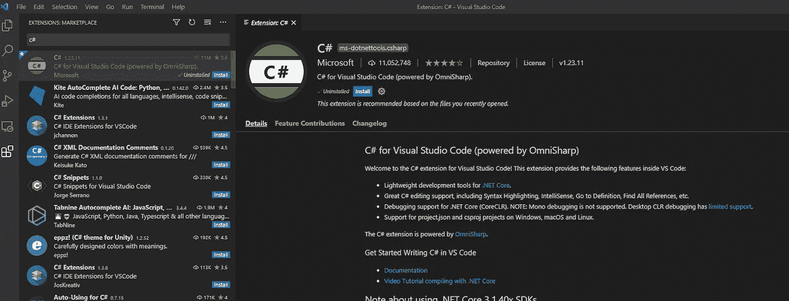
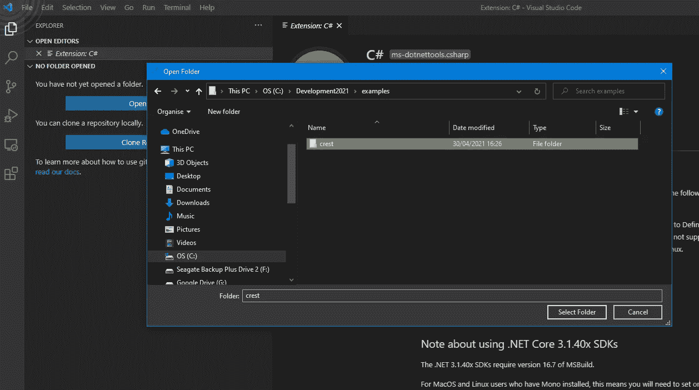
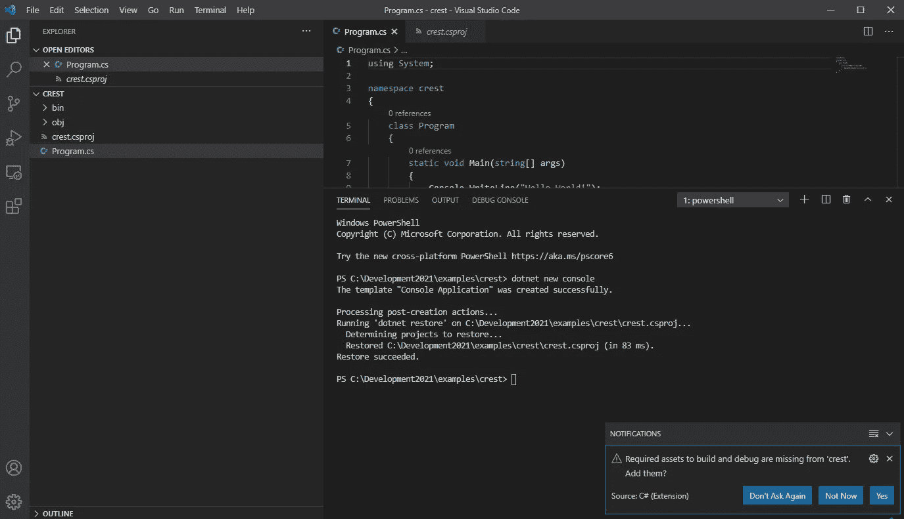
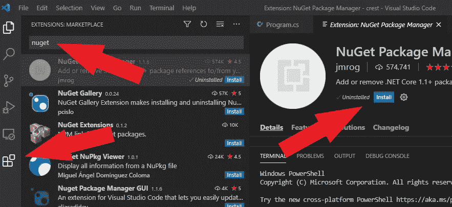
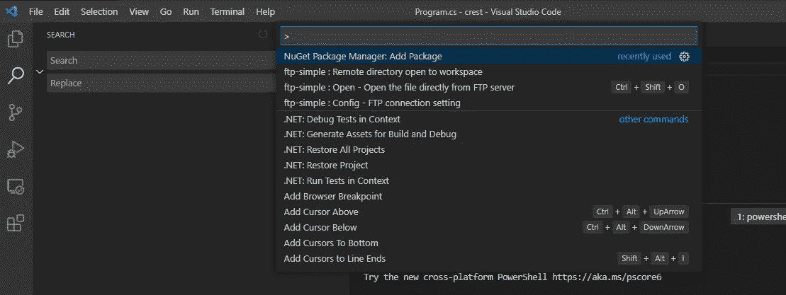

# 您的第一个 C# Websocket 客户端

> 原文：<https://medium.com/nerd-for-tech/your-first-c-websocket-client-5e7acc30681d?source=collection_archive---------0----------------------->


在本教程中，您将学习如何设置 Visual Studio 编码环境并使用 C#编写程序。您还将学习如何连接到 WebSocket 服务(在本例中是 Tradermade 的 Forex data feed ),实时获取流数据(Forex、CFD 和 Crypto ),并解析 JSON 输出。如果你以前有 Visual Studio 安装的经验，你可以直接跳到本教程的编码部分。您也可以从网站的文档部分下载预先填充了 API 密钥的代码版本 [C# WebSocket 示例](https://marketdata.tradermade.com/docs/streaming-data-api#wsCS)。本教程涵盖了少量货币，但 TraderMade 提供了超过 1500 种货币对的 WebSocket。

**让我们建立开发环境**

从 https://code.visualstudio.com/download[下载并安装 Visual studio 代码。NET Core SDK。然后，我们需要安装和设置 C#的扩展，以便在 VS 代码中工作。打开 Visual Studio 代码，选择 View - > Extension，在搜索框中输入 C#。有许多可用的扩展选项，但是对于这个代码，例如，选择 OmniSharp，选择 install 按钮。](https://code.visualstudio.com/download)



**设置项目**

现在，我们需要构建项目以连接到 WebSocket —在 windows 资源管理器中，创建一个新目录，您可以将其命名为任何名称，但对于此示例，我们将将其命名为“csWebsocket ”,因为这是一个 C# WebSocket 示例。现在打开 VSCode，选择 **File - > Open Folder** ，选择刚刚创建的文件夹。



现在该文件夹已在 VSCode 中打开，我们需要创建。net 框架—这将建立项目定义文件(.csproj)和主文件(。cs ),我们将把代码复制到其中。

**点击查看- >终端**并输入以下命令。

```
Dotnet new console
```

默认情况下，项目将填充一个“Hello World”示例。您可能还会被提示下载运行该程序所需的任何其他资产，请选择“是”。如果你没有得到提示，只需按“CTRL+SHIFT+X”。



**安装螺母**

我们需要通过包管理器安装 NuGet，选择 extension 选项卡，然后在搜索框中输入 NuGet 并单击 install。NuGet 库有助于解析通过 WebSocket 接收的 JSON。



一旦我们安装了 NuGet 包管理器，我们就可以安装我们的助手库了。按“F1”(或 Windows 上的 FN + F1)调出 VS 命令托盘。现在首先输入“NuGet”并点击命令:“NuGet Package Manager Add Package”。



这将提示另一个搜索框，我们将写“Newtonsoft”。JSON”，然后按 enter 键选择匹配的包，最后在顶部选择最新版本。


现在让我们安装 WebSocket helper 库，重复上面的步骤来加载 NuGet 包管理器，然后键入“WebSocket”。客户端”并安装最新版本。


**获取您的 API 密钥**

现在环境已经设置好了，让我们来获取您的 TraderMade API 密钥，如果您没有帐户，您可以在这里注册【https://marketdata.tradermade.com/signup，只需几秒钟，然后您就可以从 https://marketdata.tradermade.com/myAccount[下的仪表板中复制您的密钥](https://marketdata.tradermade.com/myAccount)

**现在有趣的是让我们写一些代码**

在程序的顶部，我们将添加一些导入语句，前两个是系统所需的库，我们感兴趣的是 WebSocket。客户端(这有助于获得 WebSocket helper 库)和 Newtonsoft。Json(这将帮助我们解析 JSON 数据)。

```
using System;
using System.Threading;
using Websocket.Client;
using Newtonsoft.Json;
```

然后，我们将首先定义名称空间“csWebsocket ”,在此名称空间中，我们将定义类“Program ”,名称空间已设置，因此我们不会有冲突的类。在类程序中，我们将用我们的 API 密钥在程序顶部初始化一个变量“streaming_API_Key”，别忘了添加你自己的。然后，我们将 Main 方法设置为“static void Main(string[] args)”，当方法没有返回类型时使用“void”，正如您从下面的代码中可以看到的，我们使用它来启动第二个函数“Initialize”。

```
namespace csWebsocket{
    class Program
    { private string streaming_API_Key = "your_api_key"; static void Main(string[] args) { Program prg = new Program(); prg.Initialize(); } private void Initialize() { Console.CursorVisible = false; Console.ReadKey(); } }}
```

基本结构完成后，我们将在 Initialize 方法中定义处理程序代码。“exitEvent”和“url”变量很容易理解。一旦设置好，我们将创建一个新的 WebSocket 类并注入“url”。当我们想要设置一个或多个资源时，使用“using”语句。资源的执行和释放如下所示。我们首先设置 30 秒 ReconnectTimeout，然后通过 MessageReceived 函数接收套接字连接消息，因为 WebSocket 要求用户登录，我们监听连接消息，然后使用 clinet 发回一个 JSON，其中包含用户密钥和我们需要的符号。Send()函数。

```
try
  {
      var exitEvent = new ManualResetEvent(false);
      var url = new Uri("wss://marketdata.tradermade.com/feedadv");
           using (var client = new WebsocketClient(url))
      {
          client.ReconnectTimeout = TimeSpan.FromSeconds(30); client.ReconnectionHappened.Subscribe(info =>
          {
              Console.WriteLine("Reconnection happened, type: " + info.Type);
          }); client.MessageReceived.Subscribe(msg =>
          {
              Console.WriteLine("Message received: " + msg);              if (msg.ToString().ToLower() == "connected")
                        {
                            string data = "{\"userKey\":\"" + streaming_API_Key + "\", \"symbol\":\"EURUSD,GBPUSD,USDJPY\"}";
                            client.Send(data);
                        }
          }); client.Start(); //Task.Run(() => client.Send("{ message }")); exitEvent.WaitOne();
      }
  }
catch (Exception ex)
  {
      Console.WriteLine("ERROR: " + ex.ToString());
  }
```

下面是连接到 WebSocket 和订阅几个符号的完整代码，您需要将 API 密钥复制到下面的代码中。

```
using System;
using System.Threading;
using Websocket.Client;
using Newtonsoft.Json;namespace TraderMadeWebSocketTest
{
    class Program
    {
        private string streaming_API_Key = "YOUR_USER_KEY"; static void Main(string[] args)
        {
            Program prg = new Program();
            prg.Initialize();
        } private void Initialize()
        {
            Console.CursorVisible = false; try
            {
                var exitEvent = new ManualResetEvent(false);
                var url = new Uri("wss://marketdata.tradermade.com/feedadv");                using (var client = new WebsocketClient(url))
                {
                    client.ReconnectTimeout = TimeSpan.FromSeconds(30);
 client.ReconnectionHappened.Subscribe(info =>
                    {
                        Console.WriteLine("Reconnection happened, type: " + info.Type);
                    }); client.MessageReceived.Subscribe(msg =>
                    {
                        Console.WriteLine("Message received: " + msg); if (msg.ToString().ToLower() == "connected")
                        {
                            string data = "{\"userKey\":\"" + streaming_API_Key + "\", \"symbol\":\"EURUSD,GBPUSD,USDJPY\"}";
                            client.Send(data);
                        } }); client.Start(); //Task.Run(() => client.Send("{ message }")); exitEvent.WaitOne();
                }
            }
            catch (Exception ex)
            {
                Console.WriteLine("ERROR: " + ex.ToString());
            } Console.ReadKey();
        } }
}
```

现在，您可以通过编写以下命令在 VSCode 中运行代码:

```
dotnet run .\csWebsocket.cs
```

瞧啊。你现在已经有了闪电般的价格，通过 Websocket 传入你的终端。

```
Message received: {"symbol":"EURUSD","ts":"1636114682174","bid":1.15371,"ask":1.15372,"mid":1.153715}
Message received: {"symbol":"EURUSD","ts":"1636114682202","bid":1.15371,"ask":1.15371,"mid":1.15371}
Message received: {"symbol":"USDJPY","ts":"1636114682278","bid":113.787,"ask":113.788,"mid":113.787506}
Message received: {"symbol":"USDJPY","ts":"1636114682363","bid":113.788,"ask":113.788,"mid":113.788}
Message received: {"symbol":"USDJPY","ts":"1636114682420","bid":113.788,"ask":113.789,"mid":113.7885}
Message received: {"symbol":"USDJPY","ts":"1636114682488","bid":113.789,"ask":113.789,"mid":113.789}
Message received: {"symbol":"USDJPY","ts":"1636114682632","bid":113.788,"ask":113.789,"mid":113.7885}
Message received: {"symbol":"EURUSD","ts":"1636114682635","bid":1.15371,"ask":1.15372,"mid":1.153715}
Message received: {"symbol":"EURUSD","ts":"1636114682643","bid":1.15372,"ask":1.15372,"mid":1.15372}
Message received: {"symbol":"EURUSD","ts":"1636114682682","bid":1.15373,"ask":1.15373,"mid":1.15373}
Message received: {"symbol":"EURUSD","ts":"1636114682768","bid":1.15372,"ask":1.15372,"mid":1.15372}
Message received: {"symbol":"USDJPY","ts":"1636114683727","bid":113.789,"ask":113.789,"mid":113.789}
```

**解析数据**

现在我们得到了数据，我们可以解析它并提取我们需要的信息。我们创建一个 quote 类，它具有通过 WebSocket 传入的消息的格式。复制-粘贴在页面顶部库之后和名称空间之前。

```
public class quote
        {
            public string symbol { get; set; }
            public long ts { get; set; }
            public double bid { get; set; }
            public double ask { get; set; }
            public double mid { get; set; }
        }
```

然后，我们将解析代码作为 else 语句添加到程序中，如下所示，我们使用反序列化对象将数据解析到类中，然后我们可以直接引用类属性，例如 result.symbol、result.bid。

```
client.MessageReceived.Subscribe(msg =>
                    {
                        Console.WriteLine("Message received: " + msg);
                        if (msg.ToString().ToLower() == "connected")
                        {
                            string data = "{\"userKey\":\"" + streaming_API_Key + "\", \"symbol\":\"EURUSD,GBPUSD,USDJPY\"}";
                            client.Send(data);
                        }
                        else {
                           string data = msg.Text;
                           var result = JsonConvert.DeserializeObject<quote>(data);
                           Console.WriteLine(result.symbol + " " + result.bid + " " + result.ask);
                        }
                     });
```

现在，当我们运行程序时，您应该得到原始数据和解析后的输出。

```
Message received: {"symbol":"USDJPY","ts":"1636117095648","bid":113.888,"ask":113.889,"mid":113.888504}
USDJPY 113.888 result 113.889
Message received: {"symbol":"USDJPY","ts":"1636117095653","bid":113.889,"ask":113.889,"mid":113.889}
USDJPY 113.889 result 113.889
Message received: {"symbol":"GBPUSD","ts":"1636117095658","bid":1.34458,"ask":1.3446,"mid":1.34459}
GBPUSD 1.34458 result 1.3446
Message received: {"symbol":"EURUSD","ts":"1636117095660","bid":1.15192,"ask":1.15192,"mid":1.15192}
EURUSD 1.15192 result 1.15192
```

现在，我们已经完成了使用 c# WebSocket 运行 FX 实时数据的示例。你可以从我们的 [Github 页面](https://github.com/tradermade/Dotnet-Websocket-Client/blob/main/tm_client.cs)复制完整的代码

如果你喜欢我们的文章，请鼓掌，分享和订阅，我们投入了大量资源使我们的教程对更广泛的受众可读。另外，[请联系我们](https://tradermade.com/contact)，告诉我们您的建议，或者您是否需要任何帮助。我们一直渴望收到您的来信，并乐意为您提供帮助。