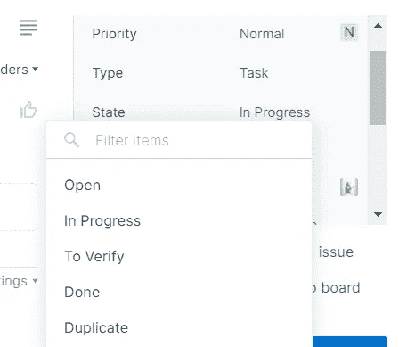
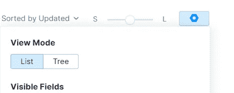
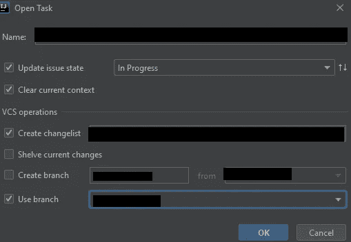

# 适用于初学者的 YouTrack

> 原文：<https://medium.com/nerd-for-tech/youtrack-for-beginners-31e1e156fdd0?source=collection_archive---------3----------------------->

YouTrack 经常在开发团队中使用，为了使用它，需要对它进行研究。我们开始吧！

YouTrack 是 JetBrains 开发的项目管理软件。它以插件的形式存在，可以附加到 JetBrains IDEs 上，比如 Intellij Idea，帮助开发团队创建和分配任务，以及跟踪工作进度。

## 概观

首先，如果你喜欢黑暗主题，登录后点击你的头像，通过下面的按钮改变主题。

YouTrack 处理我们所有人的问题。问题是一项任务或一项计划。相关的问题被收集在一起，我们称之为“T2”项目“T3”。项目有一些基本的设置和属性，如字段和集成，每个问题都继承了这些。

要查看如何首次安装和设置 YouTrack 插件，请点击[这里。](https://www.jetbrains.com/help/youtrack/standalone/Installation-and-Upgrade.html)

登录 YouTrack 后，转到上面的**项目选项卡**，选择一个项目进行研究。在左边，您可以看到您的团队成员与您一起处理同一个项目，在右边，您可以看到该项目中分配给您的团队的任务的总和。确保在浏览器中启用通知，以查看是否有新任务打开。

要讨论与您的项目相关的任何细节，或分享一些重要公告，请转到屏幕顶部的**知识库选项卡**。YouTrack 的知识库部分就像一堆堆积在一起的文章。在一篇文章中，可以嵌入文本、媒体甚至一些谷歌文档。知识库有一些选项，如**公共知识库选项卡**，您可以在其中共享信息，您的团队和第三方用户(如客户)都可以从中查看文章，或者**内部文档选项卡**，只有您团队中的成员可以访问。或者，您可以使用**非正式选项卡**来跟踪与您团队的非正式沟通。如果您在“文章”选项卡中使用星号图标为文章加星，则每当有人对文章进行更改或评论时，您都会收到通知。

**问题选项卡**帮助您查看、管理和创建团队中的任务。想要创建新任务吗？只需进入问题选项卡，点击**新问题按钮**，瞧！在上图中，您可以看到正在添加新问题的部门或项目。在“新问题”选项卡的右侧，您可以看到优先级和类型等参数，您可以将这些参数添加到新创建的问题中，以便对其进行排序。任务的**类型**基本上是必须如何声明问题的蓝图；例如，如果您希望您的团队成员创建一个问题，该问题使用屏幕截图和代码片段来引用 bug，您可以创建一个蓝图，通过“新问题”页面上的“类型”部分来指定这一点。如果您在某个项目或团队下创建任务，该团队的成员或被分配到该项目的同事将被自动分配到新问题。

将任务链接在一起

在每个任务的页面上，您会看到上方有一个链接图标，基本上将多个任务相互链接起来。此图标可用于将任务标记为子任务或父任务，或者标记为与另一个任务相关甚至依赖于另一个任务。例如，如果您不希望一个任务在另一个依赖于它的任务完成之前被标记为已完成，您之前设置的这个关系将派上用场，并且不允许这样的事情。

能见度

此外，在任务页面上，您可以决定谁可以查看该问题，并根据您的意愿随时更改该问题。

状态选项卡

要向团队成员宣布您正在进行一项任务，或者您的任务正在等待验证或者已经完成，只需转到任务页面并点击右侧的**状态选项卡**。

您可以在问题页面下对每个问题撰写评论，甚至可以通过**附加文件按钮**将文件附加到您的评论中。你甚至可以通过@键和他们的用户名为某个人写评论。

排序方法选项卡

在“问题”选项卡上，您可以通过右侧的“设置”图标确定如何显示问题并对其进行排序。如果您喜欢以树模式查看问题，该页面将显示每个任务之间的关系以及任务本身。

搜索功能区

您可以通过“问题”选项卡上方的功能区指定您的搜索。在那里，您可以查看分配给某个人的问题或按优先级对它们进行排序。您也可以通过搜索栏上的保存按钮保存搜索。

Agile 板，图标功能区

**Agile Boards 标签**允许您以表格的形式查看您的任务。在这里，您可以看到它们按类别或状态进行组织。如果你想通过一个集成的版本控制系统(比如 Git)来查看你在一项任务上花了多少时间、评论、你的工作历史和你所做的改变，只需进入它并向下滚动到图标功能区。

您可以通过“状态”标签或“Agile Boards”标签，以拖放的方式将问题从“进行中”状态移到“已完成”状态。您也可以通过您正在使用的 IDE 来实现这一点，我们将在下面进一步解释这种方法。

## 通过 IDE 使用 YouTrack

所有 JetBrains IDEs，如 Intellij IDEA、Rider 或 CLion，都有一个支持问题管理的插件。为了在你的团队中使用 YouTrack，你需要首先在你的 IDE 上安装 **YouTrack 插件**。请记住，YouTrack 插件可以与所有 JetBrains IDEs 一起工作，并且也支持 Android Studio！

在你的 IDE 上安装了 **YouTrack 插件**之后，你需要进行配置。假设你正在和一个团队合作，那么我们继续输入服务器名，比如 myTeam.jetbrains.com，然后输入通过 YouTrack 网站提供给你的密码或密钥。

如果您想添加一个指定的提交消息蓝图，只需转到服务器配置窗口下的**提交消息**选项卡并创建一个即可。您可以键入特定的单词或使用花括号中的变量，如{id}、{summary}。

YouTrack 按钮

配置完成后，你会在 IDE 的左下方看到一个 **YouTrack 按钮**。在那里，您可以看到与您通过 YouTrack IDE 窗口上的**搜索栏**输入的任何搜索查询相匹配的问题列表。您也可以点击 YouTrack 窗口右侧的面板按钮，查看所选问题的详细信息。如果某个问题对您很重要，您可以使用锁定图标将其锁定在 YouTrack 窗口的新选项卡上。

YouTrack 管理按钮

您可以使用箭头按钮打开任务，并通过打开的任务窗口，您可以更改任务的状态或它将推送到的分支。

打开任务窗口

您可以通过 YouTrack 管理按钮中的**应用命令**按钮将问题分配给您自己，更改其状态，添加评论和观察者。

要查看和修复问题，只需转到 ide 上 YouTrack 按钮旁边的版本控制按钮，然后单击问题名称，这也是一个链接。

当您准备好提交时，只需转到项目顶部的 Git 选项卡，然后单击**提交**。

您还可以通过此处的提交消息更改问题的状态。为此，只需使用以下结构；

> #验证提交消息的名称

或者

> #名称就绪提交消息